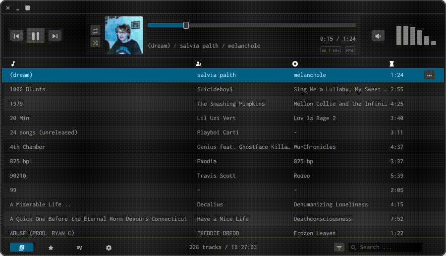

# Gem Player

A lightweight music player built in Rust using [egui](https://github.com/emilk/egui) and [rodio](https://github.com/RustAudio/rodio).

# Features

- Audio formats such as mp3, m4a, wav, flac, ogg, etc.
- Playlisting. Stored as m3u files which can be imported / exported.
- Sorting and filtering.
- Queue management. Shuffle and repeat.
- Dark and light mode.
- Cross-platform.
- Key controls.
- Automatic library reloading.

# Installation

Download the latest release from the [releases page](https://github.com/JamesMoreau/gem-player/releases)
