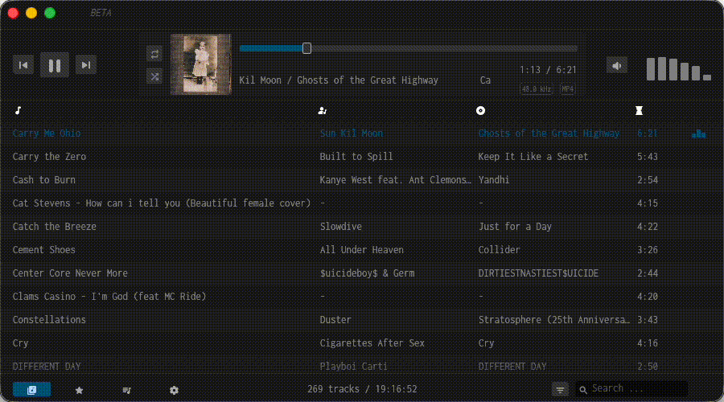

# Gem Player

An open-source, lightweight music player built in Rust using [egui](https://github.com/emilk/egui) and [rodio](https://github.com/RustAudio/rodio).

# Features

- Supports popular audio formats including MP3, M4A, WAV, FLAC, OGG, and more.
- Playlists stored as M3U files, with import and export support.
- Audio visualization.
- Sorting and filtering.
- Queue management with shuffle and repeat.
- Dark and light modes.
- OS media controls integration.
- Automatic library reloading.
- Privacy-first. No analytics. Your data stays on your machine.

# Installation

Download the latest release from the [releases page](https://github.com/JamesMoreau/gem-player/releases)

# Support

If you like this project, consider supporting me: [kofi](https://ko-fi.com/jamesmoreau)
