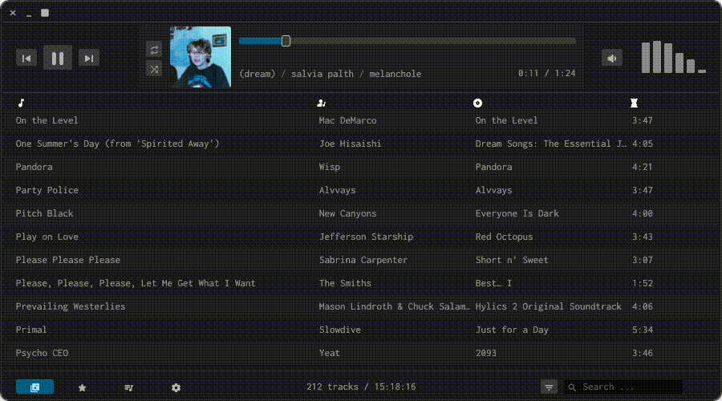

# Gem Player

An open-source, lightweight music player built in Rust using [egui](https://github.com/emilk/egui) and [rodio](https://github.com/RustAudio/rodio).

# Features

- Supports most audio formats such as mp3, m4a, wav, flac, ogg, etc.
- Playlisting. Stored as m3u files which can be imported / exported.
- Audio visualization.
- Sorting and filtering.
- Queue management. Shuffle and repeat.
- Dark and light mode.
- Cross-platform (MacOS, Linux and Windows).
- Key controls.
- Automatic library reloading.
- Privacy first. No analytics. All data stays on your machine.

# Installation

Download the latest release from the [releases page](https://github.com/JamesMoreau/gem-player/releases)

# Support

If you like this project, consider supporting me: [kofi](https://ko-fi.com/jamesmoreau)
